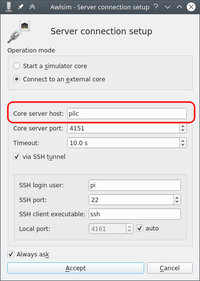
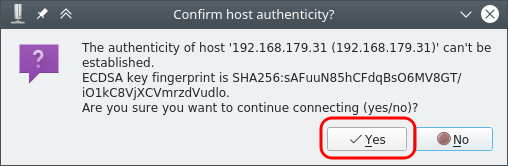
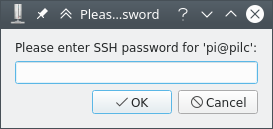
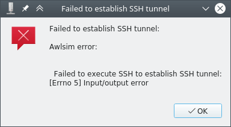
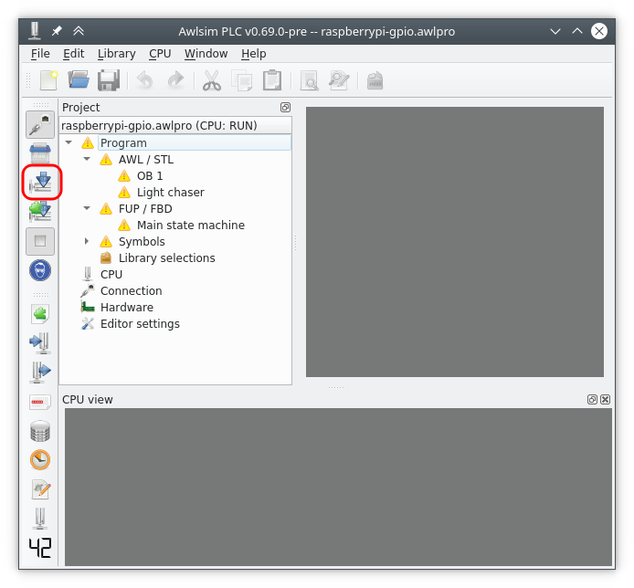

# PiLC - The Raspberry Pi PLC

[PiLC](https://bues.ch/a/pilc) is a [Raspbian](https://www.raspberrypi.org/) Operating System derivative that comes with Awlsim preinstalled and ready-to-go.

PiLC can be used to run a Raspberry Pi just like a "real" PLC.

## How to setup PiLC on the Raspberry Pi?

Just copy the PiLC image file onto an SD card. The process of installing PiLC is exactly the same as installing the standard Raspbian distribution.

Please see the [install instructions](https://bues.ch/a/pilc#install) for more details.

There is no need to set up anything else. The PiLC image is pre-configured so that the Awlsim core will automatically start during bootup. The Awlsim core on the PiLC listens to SSH connections on the Ethernet port.

## How to connect to the PiLC?

1. Connect the Raspberry Pi's Ethernet port to your network and power up the Raspberry Pi. It will automatically fetch an IP address from your router.

1. Check your router information page to see which IP address the Raspberry Pi obtained.

1. Start the Awlsim GUI on your PC.

1. Load the example project `raspberrypi-gpio.awlpro` that is shipped with Awlsim into the Awlsim GUI by clicking `File` and then `Open project...`

1. Then connect to the PiLC by clicking `CPU` and then `Go online (Connect to a CPU)` in the menu bar.

1. Enter the IP address of your Raspberry Pi here: 
   

1. Then click `Accept`.

1. If Awlsim asks you to confirm the connection authentication, click `Yes`: 
   

1. Finally type in the Raspberry Pi login password. The default password is `raspberry` 
   

## Connection failure

If the connection fails with the following error message, it might be due to a failed SSH authentication: 

This will happen, if you re-install PiLC on the Raspberry Pi. 
Re-installing PiLC generates new SSH keys and therefore causes subsequent authentications to fail.

To fix this delete the SSH authentication (`known_hosts` entry) on the PC (*not* on the Raspberry Pi).
If you are using OpenSSH/Linux on the PC, enter the following command into a command prompt:

`ssh-keygen -R 192.168.0.10`

Replace `192.168.0.10` with the IP address of your Raspberry Pi.

## How do I get my PLC program onto PiLC?

Just connect to PiLC (see previous chapter) and click the `download` button in the Awlsim GUI. This will transfer the program over to the PiLC. 

If the PiLC is not in RUN state, click the RUN button to start the program.

## Where does Awlsim store its state on the Raspberry Pi?

The Awlsim working directory is `/etc/awlsim/` 
The loaded project and other configuration files are stored there.
