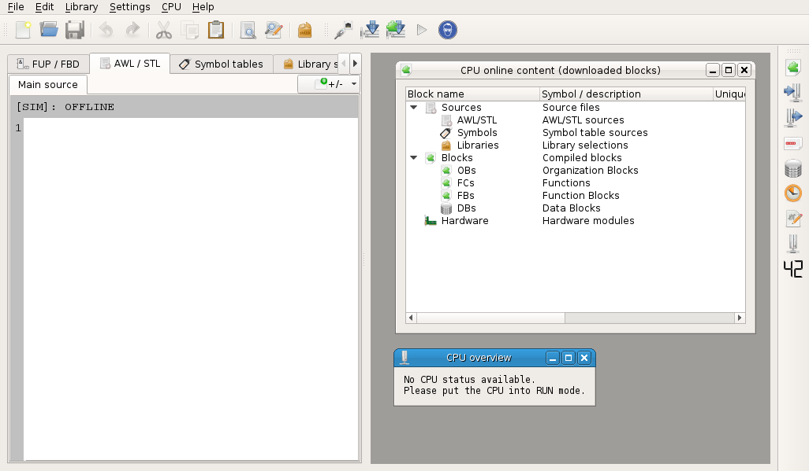
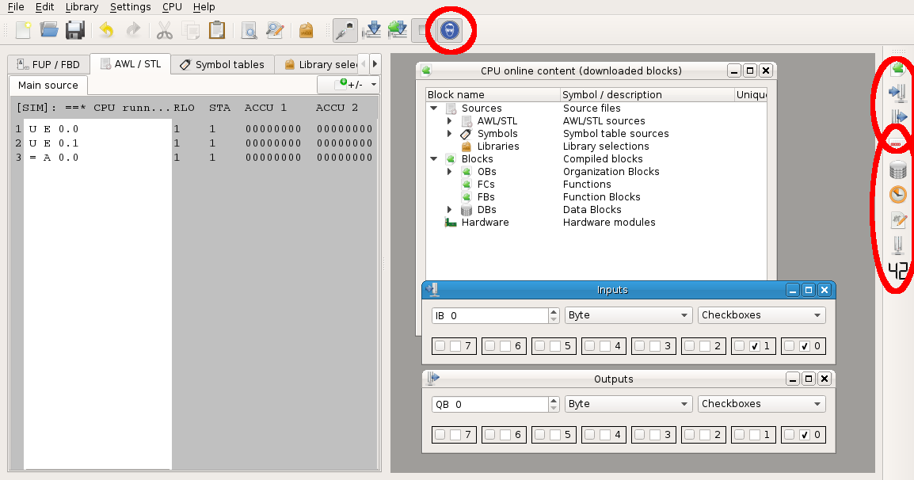

Awlsim - Quick start tutorial
=============================

Start the GUI by invoking `awlsim-gui` on Linux, `awlsim-win.cmd` on Windows or `awlsim.cmd` on Windows (Awlsim standalone package). The following screen will appear:

Enter the AWL/STL program in the editor area:

Press the `download all sources` button. If you did not do this before, the `connect dialog` will appear. Just select a `simulator core` and click `Accept`.

You will need to download the sources again, if you edit the sources later. But the `connect dialog` will not appear again.

Press the `RUN` button to start the simulated CPU:

You may want to open some inspection windows to see the program output or manually set some program input:

